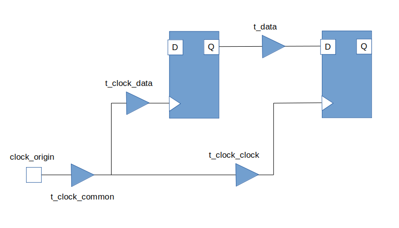

Base Form
=========

Every static timing situation can be reduced to the following basic form:

Where:

clock_origin is the common point the clock from the launch and capture flop can be traced back to.

t_clock_common is the common clock delay shared by the launch and capture flop.

t_clock_clock is the clock delay only seen by the capture flop.

t_clock_data is the clock delay only seen by the launch flop.

t_data is the data delay from the Q output of the launch flop to the D input of the capture flop.

No matter how complex the physical implementation, it can be reduced to this form.

Setup equation
##############

We can derive the setup equation
