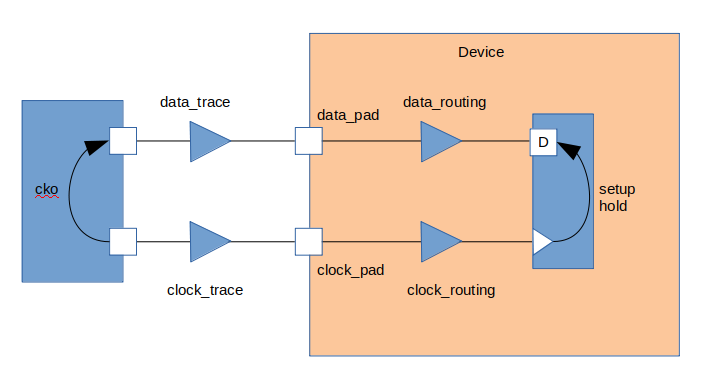
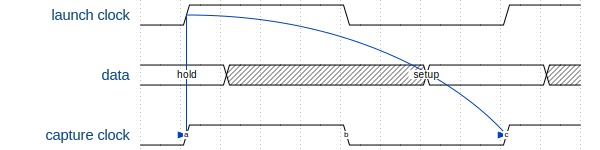
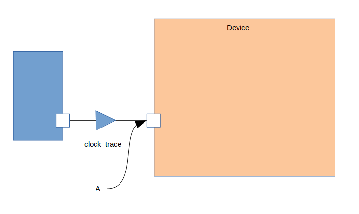
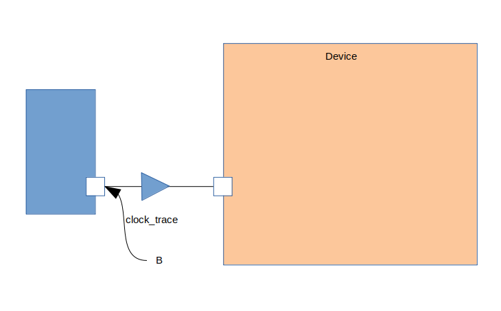
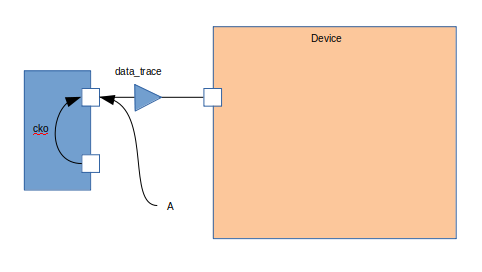
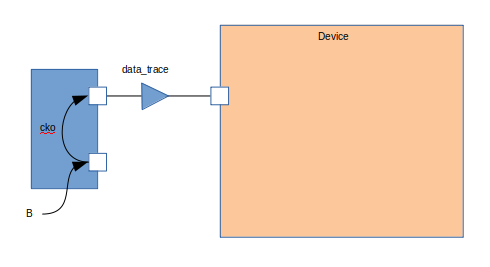

Source Synchronous Input Timing
===============================

A source synchronous input is an interface in which the data is co-incident with a clock.
In addition, there is a known relationship between the clock and the data.
The diagram below illustrates the timing elements involved:

These can be divided into three major groups:

-  Source Device Variables
-  Trace Delays
-  Device Delays

Waveform
--------

The timing diagram below shows the setup and hold edges.

Data is launched from the rising edge of the launch clock.
Data is captured on the risinge edge of the capture clock.

This means the setup check is from edge 1 to edge c.
Data must be stable before edge C to pass the setup check at the capture flop.

The hold check is from edge 1 to edge a.
Data must be held stable after edge A to pass the hold check at the capture flop.

Source Device Variables
-----------------------

Source device variables refer to constraints imposed on the input path by the device sending data.
In a source synchronous interface the variables are:

-  clock period
-  clock to out (cko)

Clock Period
~~~~~~~~~~~~

Setup checks are dependent on the frequency of the clock and will use the clock period variable.
Hold checks are frequency independent, and will not use the clock period variable.

Clock to Out
~~~~~~~~~~~~

The clock to out variable defines the relationship between the launching edge of the clock and the data.
There will be maximum and minimum values.

The maximum is the time from the launching clock to the latest data will be valid.
The minimum is the time from the launching clock to the earliest data will be invalid.

The difference between the two numbers defines the region in which data is unstable.

Trace delays
------------

Trace delays represent the latency of signals from one device to another.
They are also known as board delays or flight times.

Each trace will have a maximum and minimum delay.
If there is a bus, then a maximum and minimum delay over the entire bus is typically calculated.

There will be delays for both data and clock.

.. code:: tcl

    set t_data_trace_max 1.2
    set t_data_trace_min 0.4

    set t_clock_trace_max 1.2
    set t_clock_trace_min 0.4

Device Delays
-------------

Device delays represent the delays and constraints inside the device we are timing.
They can be broken out into three distinct types:

-  Pad Delays
-  Routing Delays
-  Setup and Hold Constraints

Pad Delays
~~~~~~~~~~

Pad delays are the delays through the input pad.
This was broken out seperately to illustrate different elements within the device.

Both the clock and data will have a maximum and minimum time through the pad.

.. code:: tcl

    set t_data_pad_max 1.2
    set t_data_pad_min 0.4

    set t_clock_pad_max 1.2
    set t_clock_pad_min 0.4

Routing Delays
~~~~~~~~~~~~~~

Routing delays are the delays each signal takes from the pad to the destination.
For the data path, it includes any combinatorial logic and buffers to the D input of a capturing flop.
For the clock path, it includes routing through the clock tree, any clock managers (DLLs, PLLs, etc...) to the clock input of the capturing flop.

.. code:: tcl

    set t_data_routing_max 1.2
    set t_data_routing_min 0.4

    set t_clock_routing_max 1.2
    set t_clock_routing_min 0.4

Setup and Hold Constraints
~~~~~~~~~~~~~~~~~~~~~~~~~~

The setup and hold constraints on the capturing flop represent the minimum times data must be stable on either side of the capturing clock edge.
Setup defines the required stable time before the clock edge.
Hold defines the required stable time after the clock edge.

.. code:: tcl

    set t_setup 0.5
    set t_hold 0.5

Derive Hold Equation
--------------------

For a hold check, the data must be held stable for some time after the clock transitions.
To derive the hold equation, we need to check the worst case timing arcs.
This requires using the least (fastest) data delay against the most (slowest) clock delay.

.. math:: data_{min} + cko_{min} > clock_{max} + t_{hold}

The equation is an inequality and we can re-arrange the equation:

.. math:: data_{min} + cko_{min} - clock_{max} - t_{hold} > 0

We can see from this equation that if the data delay helps a hold check while clock delay and a positive hold requirements hurts.

Expanding the data and clock path yields:

.. math:: cko_{min} + data_{ trace_{min}} + data_{pad_{min}} + data_{routing_{min}} - clock_{trace_{max}} - clock_{pad_{max}} - clock_{routing_{max}} - t_{hold} > 0

This equation tells us if the is enough slack in the hold timing check.

A negative slack indicates the data path is not long enough to meet the hold requirement on the capturing flop.
To fix this, either increase the delay in the data path and/or decrease the delay in the clock path.

Derive Setup Equation
---------------------

For a setup check the data must be stable for some time before the clock transistions.
To derive the setup equation, we need to check the worst case timing arcs.
This requires using the most (slowest) data delay against the least (fastest) clock delay.

.. math::  data_{max} + cko_{max} + t_{setup} < clock_{min} + clock_{period}

The equation is an inequality and we can re-arrange it to produce a slack equation:

.. math::  0 < clock_{min} + clock_{period} - data_{max} - cko_{max} - t_{setup} 

We can see from this equation that clock delay helps a setup check while data delay and a positive setup requirement hurts.

Exanding the data and clock paths yields:

.. math:: clock_{trace_{min}} + clock_{pad_{min}} + clock_{routing_{min}} + clock_{period} - cko_{max} - data_{trace_{max}} - data_{pad_{max}} - data_{routing_{max}} - t_{setup} > 0

This equation tells us if there is enough slack in the setup timing check.

Writing Timing Constraints
--------------------------

The previous sections described the timing arcs and derived the equations.
Now we need to write timing contraints to ensure the interface will be timed correctly.
Writing the constraints involves the following steps:

-  Create the receive clock
-  Apply delays to input data path

It is important to write the constraints to match reality.
The following will step through every command and explain why it is used.

Create Receive Clock
~~~~~~~~~~~~~~~~~~~~

We will use the **create_clock** command to create the receive clock.

.. code:: tcl

    create_clock -period $clock_period -name $clock_pin [get_pins $clock_pin]

When the command is issued, the clock is placed on the input pin, point **A** in the diagram below:

However, we need to move the clock to point B in the diagram below:

We move the clock to the output of the transmitting device using the **set\_clock\_latency** command:

.. code:: tcl

    set_clock_latency -source -max $t_clock_trace_max [get_clocks $clock_pin]
    set_clock_latency -source -min $t_clock_trace_min [get_clocks $clock_pin]

The **-max** sets the maximum trace delay on the clock, while the **-min** will set the minimum trace delay on the clock.
the **-source** indicates the delay on the clock is before the point the clock is defined.

Apply Delays to Data Path
~~~~~~~~~~~~~~~~~~~~~~~~~

We need to model the external world for the timing en
By adding the just the trace delay, we will be placing the data at point A in the diagram below:

However, principle CLK-001 states for valid timing we must be able to trace back to the same clock point.
We need to move the launching to point B in the diagram below:

We do this by adding the clock to out to the trace delay:
The data path and clock path now originate from the same point so the timing analysis will be valid.

We will use the **set\_input\_delay** command to add the clock to out and data trace delay to the data pins.
This command will also bind the clock to the data pins.

.. code:: tcl

    set_input_delay -clock [get_clocks $clock_pin] -max -source_latency_included [expr $t_cko_max + $t_data_trace_max] [get_pins $data_pins]
    set_input_delay -clock [get_clocks $clock_pin] -min -source_latency_included [expr $t_cko_min + $t_data_trace_max] [get_pins $data_pins]

The **-clock** argument tells the timing tool the delays are relative to the clock specified.
The **-source\_latency\_included** argument tells the timing tool we have added source latency to the clock path using the **set\_clock\_latency** command.
   

Validating Timing Report
------------------------

It is crucial to validate the timing report generated by the STA tool.
Various elements must be checked to ensure they match what we expect.
This includes:

-  launch clock edge
-  capture clock edge
-  input delay values
-  clock pessimism recovery
-  clock uncertainty
-  data path cells
-  clock path cells
-  slack
